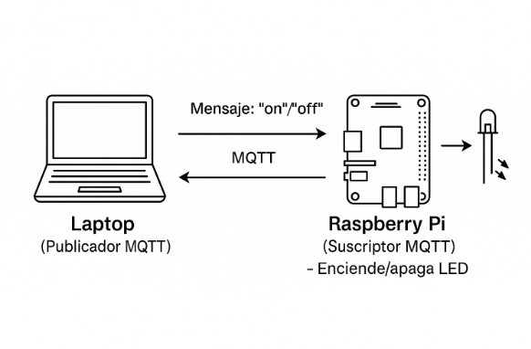
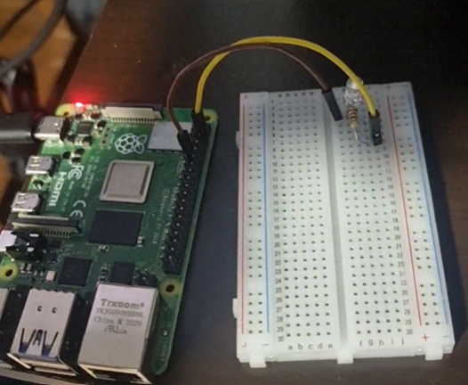

# Robotica2
## Nombres: Cristian Alejandro Durán Ignacio - Alfaro Ayzama José Fernando - Ever Rolando Rejas Espinoza

# 🚀 Proyecto 3

## 💡 Control de LED por MQTT entre Laptop y Raspberry Pi 4
### Este proyecto demuestra cómo comunicar una laptop y una Raspberry Pi mediante el protocolo **MQTT**, utilizando la laptop como **publicador** y la Raspberry Pi como **suscriptor**. A través de comandos enviados por la PC (`on` / `off`), se puede encender o apagar un LED conectado a la Raspberry Pi.

## 📌 Introducción
### Este proyecto permite encender o apagar un LED conectado a una **Raspberry Pi 4** usando comandos enviados desde una **laptop** a través del protocolo **MQTT**. La comunicación se realiza mediante un broker local (Mosquitto) alojado en la Raspberry.  
El objetivo es ilustrar cómo funcionan los roles de **publicador** (laptop) y **suscriptor** (Raspberry Pi) con MQTT en un entorno IoT básico.

## 🧰 Tecnologías y Librerías
- Python 3
  
- MQTT con [paho-mqtt](https://pypi.org/project/paho-mqtt/)
  
- [RPi.GPIO](https://pypi.org/project/RPi.GPIO/) para control de pines en la Raspberry Pi
  
- Raspberry Pi 4 con sistema operativo Raspbian
  
- LED, resistencia de 220Ω, cables de conexión

## ⚙️ Esquema de funcionamiento
El esquema muestra cómo la laptop envía comandos al servidor MQTT (Mosquitto), que luego los redirige a la Raspberry Pi para encender o apagar un LED según el mensaje recibido.
Esta arquitectura sigue el modelo publicador-suscriptor del protocolo MQTT.

<p>
  
</p>

## 🚀Para armado y utilizacion de codigo
### Clonar el repositorio :  
```bash
git clone https://github.com/Josefer98/Robotica2_.git
```
### 🛠️ Dependencias y libreiras necesarias 
## 💻 Laptop
intalar paho-mqtt
```bash
pip install paho-mqtt
```

abrir un entorno que ejecute python y copiar el codigo de publicador 

## 🍓 Raspberry Pi 4 (Suscriptor y Broker)
libreiras 
```bash
pip install paho-mqtt RPi.GPIO
```
broker
```bash
sudo apt update
sudo apt install mosquitto mosquitto-clients
sudo systemctl enable mosquitto
sudo systemctl start mosquitto
```
copiar el codigo de suscriptor en un entorno en la Raspberry Pi 4
### 🔌 Conexión del LED (GPIO)
-Pin positivo del LED → GPIO 17 (pin físico 11)

-Pin negativo del LED → Resistencia de 220Ω → GND

  <p>
  
  </p>
  
## 🚀 Cómo ejecutar
### 🍓En la Raspberry Pi 4 (Suscriptor)
Guarda el siguiente código como led_subscribe.py y ejecútalo:
```bash
python3 led_subscribe.py
```
Esto suscribe a la Raspberry al tópico casa/led y controla el LED.
### 💻En la Laptop (Publicador)
Asegúrate de que la IP del broker en led_publish.py sea la IP local de tu Raspberry Pi:
```bash
broker = "192.168.84.231"
```
Ejecuta el código:
```bash
python3 led_publish.py
```
Escribe comandos:
```bash
Mensaje a enviar: on    → Enciende el LED  
Mensaje a enviar: off   → Apaga el LED  
Mensaje a enviar: salir → Cierra el programa
```

## 📌 Notas importantes

-Ambos dispositivos deben estar conectados a la misma red Wi-Fi.

-El puerto MQTT por defecto (1883) debe estar abierto y accesible en la Raspberry.

-Si usas otro tópico distinto a casa/led, recuerda modificarlo en ambos códigos.
  
# 🎥Demostracion de funcionamineto

 
